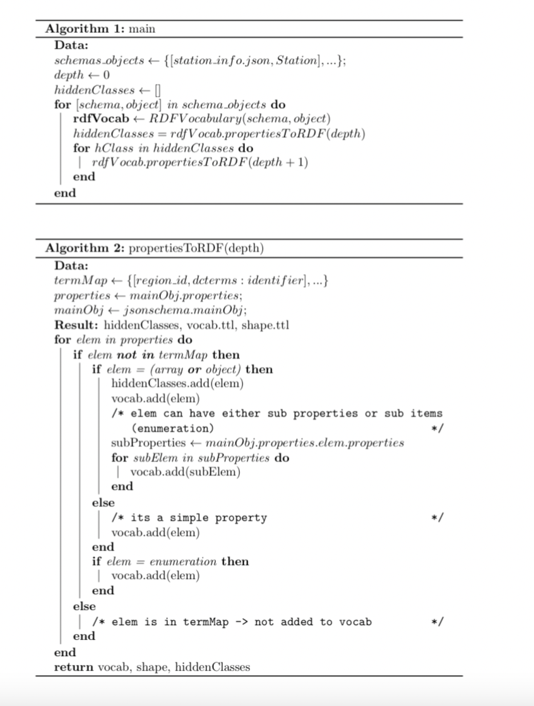

# JSON Schema to RDF

According to Linked-Data best practices, RDF vocabularies and Shacl shapes are desiderata.
This is a component tailored to the current GBFS use case and json schema structure.
It transforms GBFS JSON schemas into corresponding RDF vocabularies and Shacl shapes.

## How to use

 * Install dependencies using `npm install`
 * Build the typescript using `npm run build`
 * Run jsonschema2rdf by running `node main.js`
 
 Extra
 * Check the resulting vocabularies and provide feedback on term mapping choices.

## Program flow

* the `files` folder contains GBFS json schemas.
* the `build` folder contains the vocabularies and shapes generated by the component.
* foreach json schema in `files`, `main.ts`instantiates a `Configuration.ts`to set the basic info of the vocabulary; it then instantiates `rdfVocabulary.ts`to create the equivalent vocabulary and shape.
* `rdfVocabulary.ts`is responsible for creating both the vocabulary and shapes.
* `rdfVocabulary.ts` uses `shaclShape.ts` to initialize the basics of the shape such as the target class, and to get the corresponding property shapes.

 

## Useful links
 * mobility data bike sharing system json schemas: https://github.com/MobilityData/gbfs-json-schema

## Author
Andrei Popescu <andrei.popescu@ugent.be>

## ToDos

 * update the term map with existing terms from LOV
 * test
    # List of unmanaged details
    - Shacl shapes creation needs better integration in the code.
    - start_time, end_time pattern in system_hours.json 
    - minimum/maximum in system_calendar.json
    - minimum in vehicle_types.json
    - ? (any other missing)

## Future Work
* gbfs.json apparently has a slightly different structure, so it needs special treatment -> ignored for now
* in the utopian scenario, we want `rdfVocabulary` to become fully generalisable; this way, the component could be applied to other usecases; How to do that? Available json-schema parsers? 

 

